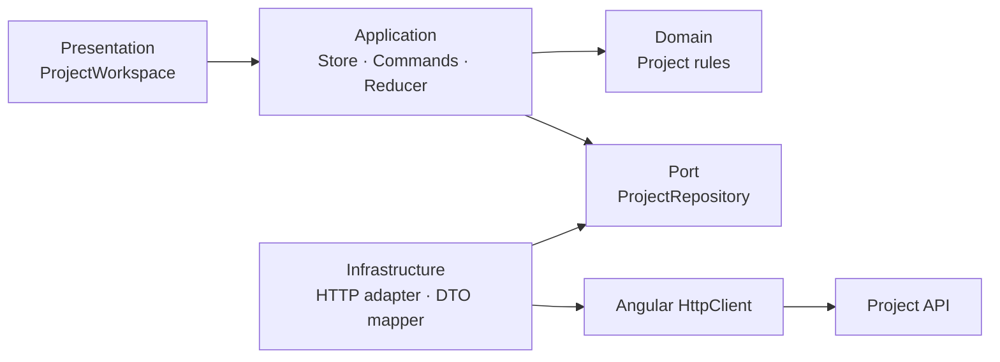

# Enterprise Angular Architecture Foundations

## OpsFlow

[](https://github.com/mrozmen7/enterprise-angular-architecture-foundations/actions/workflows/ci.yml)
[](https://github.com/mrozmen7/enterprise-angular-architecture-foundations/actions/workflows/deploy-pages.yml)
[](https://angular.dev/)
[](LICENSE)

> A tested, documented, and deployed Angular 22 reference architecture built from real business
> requirements rather than a preselected folder template.

### [Open the live application](https://mrozmen7.github.io/enterprise-angular-architecture-foundations/)

OpsFlow is a project operations workspace for consulting teams. The application began as one simple
Angular component and evolved through eight traceable chapters into a production-minded architecture
with domain modeling, dependency inversion, immutable state, Signals, RxJS concurrency, HTTP
boundaries, optimistic updates, conflict handling, architecture fitness checks, CI, and CD.

## What this project demonstrates

- standalone Angular 22 with strict TypeScript and strict templates;
- explicit Project, Customer, TeamMember, status, priority, timeline, and version models;
- presentation, application, domain, port, and infrastructure boundaries;
- replaceable repository implementations through Angular dependency injection;
- private writable Signals with public readonly and computed state;
- pure immutable reducers and typed commands;
- `switchMap`, `concatMap`, `exhaustMap`, and `forkJoin` selected by business concurrency rules;
- recoverable idle, loading, success, and error states;
- validated API DTOs before data enters the domain;
- cache-first loading and explicit network refresh;
- optimistic priority updates, rollback, and HTTP 409 conflict reconciliation;
- accessibility fundamentals and responsive presentation;
- 56 deterministic tests across eight suites;
- automated architecture dependency checks across 19 production feature files;
- GitHub Actions CI and GitHub Pages deployment.

## Architecture



Dependencies point toward stable business meaning. Domain and application code do not know
`HttpClient`, URL shapes, or transport DTOs. The composition root connects the repository port to
the HTTP adapter.

See the complete [architecture guide](docs/architecture.md) and
[Architecture Decision Records](docs/adr/README.md).

## Representative workflows

### Search

```text
search Signal
  -> debounce
  -> distinct
  -> switchMap
  -> HTTP repository
  -> recoverable RequestState
  -> readonly Signal
```

Only the newest search may update the view.

### Optimistic priority update

```text
capture Project v1 / High
  -> render Low immediately
  -> PATCH expectedVersion=1
       success  -> accept server Project v2 / Low
       failure  -> restore Project v1 / High
       conflict -> accept newer validated server Project
```

### Quality and deployment

```text
push / pull request
  -> format
  -> architecture boundaries
  -> 56 tests
  -> production build
  -> Pages artifact
  -> github-pages environment
  -> live HTTPS application
```

## Eight-chapter evolution

| Chapter | Focus                           | Enterprise outcome                                           |
| ------- | ------------------------------- | ------------------------------------------------------------ |
| 1 ✅    | Application and complexity      | Identify responsibilities, state, and change pressure        |
| 2 ✅    | Domain and state modeling       | Represent business rules and valid states explicitly         |
| 3 ✅    | Separation of concerns and DI   | Isolate UI, application, domain, and infrastructure concerns |
| 4 ✅    | Immutable state transitions     | Make state changes predictable and traceable                 |
| 5 ✅    | Signals and derived state       | Build scoped reactive state with clear ownership             |
| 6 ✅    | RxJS and concurrency            | Control cancellation, ordering, parallelism, and failures    |
| 7 ✅    | Server and distributed state    | Handle optimistic updates, stale data, and conflicts         |
| 8 ✅    | Testing and architecture review | Enforce, verify, deploy, and publish the reference           |

Each chapter has a learning guide, completion review, dedicated commit, and Git tag.

## Repository structure

```text
src/app/projects/
├── application/      workflows, commands, reducer, request state
├── data/             learning/demo seed data
├── domain/           business vocabulary and validation
├── infrastructure/   HTTP adapter, DTO mapping, course API
├── ports/            infrastructure-independent contracts
├── presentation/     Angular component, template, styles
└── project.providers.ts

docs/
├── adr/              architectural decisions and trade-offs
├── learning/         eight chapter guides and reviews
├── architecture.md
├── test-strategy.md
└── production-readiness.md
```

## Run locally

Requirements:

- Node.js 24.15+
- npm 11.6+

```bash
git clone git@github.com:mrozmen7/enterprise-angular-architecture-foundations.git
cd enterprise-angular-architecture-foundations
npm ci
npm start
```

Open `http://localhost:4200`.

## Verify locally

```bash
npm run format:check
npm run architecture:check
npm run test:ci
npm run build
```

The GitHub Pages artifact can be reproduced with:

```bash
npm run build:pages
```

## Documentation

- [Reference architecture](docs/architecture.md)
- [Risk-based test strategy](docs/test-strategy.md)
- [Production readiness review](docs/production-readiness.md)
- [CI/CD learning guide](docs/ci-cd.md)
- [Course charter](docs/course-charter.md)
- [Eight-chapter roadmap](docs/roadmap.md)
- [Architecture Decision Records](docs/adr/README.md)
- [Chapter 8 learning guide](docs/learning/section-08-overview.md)
- [Chapter 8 completion review](docs/learning/section-08-completion.md)

## Honest deployment boundary

The live site uses Angular's real `HttpClient` pipeline with an in-memory interceptor that behaves as
the course API. It demonstrates frontend architecture, request contracts, caching, rollback, and
conflict behavior without claiming to operate a production backend. The
[production readiness review](docs/production-readiness.md) lists the integrations required for a
real company deployment.

## Contributing

Contributions are welcome. Read [CONTRIBUTING.md](CONTRIBUTING.md) before opening a pull request.

## License

This project is available under the [MIT License](LICENSE).

---

**Core principle:** Start with the simplest design that satisfies today's requirement, then evolve
it when evidence reveals new architectural pressure.
